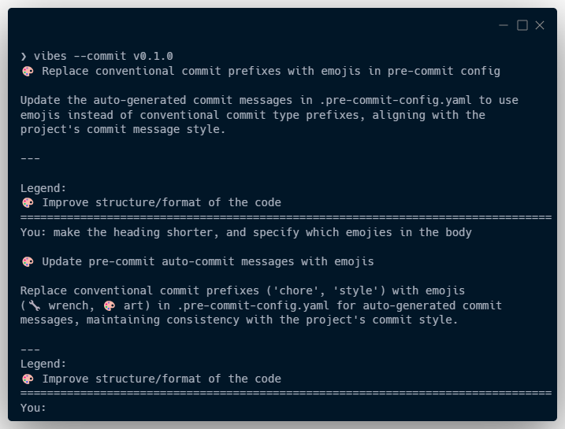

# vibes

[![Tests][tests-badge]][tests-link]
[![Documentation Status][rtd-badge]][rtd-link]
[![uv][uv-badge]][uv-link]
[![Ruff][ruff-badge]][ruff-link]
[![Black][black-badge]][black-link]
\
[![Made Using tsvikas/python-template][template-badge]][template-link]
[![GitHub Discussion][github-discussions-badge]][github-discussions-link]
[![PRs Welcome][prs-welcome-badge]][prs-welcome-link]

## Overview

Get a commit message from ChatGPT or Claude, with [gitmoji](https://gitmoji.dev/) ✨.\
Talk to the AI and request changes, until you're happy with the message.

### Installation

- Clone the repo
- Set-up a `.env` file
- Use uv to create a venv
- Link to .venv/bin/vibes

Future improvements: Streamlined installation method.

### Usage

Just run `vibes` in your git repo, to get an LLM to suggest a commit message for
your current changes (the index, or the working directory, or the last commit)

Use `-r` to specify a path to the repo (default `.`).
Use `-c` to specify a specific commit, or a commit range.
Use `-d` to describe the change to the LLM yourself.

You can chat with the LLM and request changes.
When you finish, end the conversation (^C, ^D, exit, quit, or Enter)
and use the message.

Future improvements: The ability to control the prompt, and the template.

## Development

### Getting started

- install [git][install-git], [uv][install-uv].
- git clone this repo: `git clone tsvikas/vibes.git`
- run `uv run just prepare`

### Tests and code quality

- use `uv run just format` to format the code.
- use `uv run just lint` to see linting errors.
- use `uv run just test` to run tests.
- use `uv run just check` to run all the checks (format, lint, test, and pre-commit).
- Run a specific tool directly, with `uv run pytest`/`ruff`/`mypy`/`black`/...

[black-badge]: https://img.shields.io/badge/code%20style-black-000000.svg
[black-link]: https://github.com/psf/black
[github-discussions-badge]: https://img.shields.io/static/v1?label=Discussions&message=Ask&color=blue&logo=github
[github-discussions-link]: https://github.com/tsvikas/vibes/discussions
[install-git]: https://git-scm.com/book/en/v2/Getting-Started-Installing-Git
[install-uv]: https://docs.astral.sh/uv/getting-started/installation/
[prs-welcome-badge]: https://img.shields.io/badge/PRs-welcome-brightgreen.svg
[prs-welcome-link]: http://makeapullrequest.com
[rtd-badge]: https://readthedocs.org/projects/vibes/badge/?version=latest
[rtd-link]: https://vibes.readthedocs.io/en/latest/?badge=latest
[ruff-badge]: https://img.shields.io/endpoint?url=https://raw.githubusercontent.com/astral-sh/ruff/main/assets/badge/v2.json
[ruff-link]: https://github.com/astral-sh/ruff
[template-badge]: https://img.shields.io/badge/%F0%9F%9A%80_Made_Using-tsvikas%2Fpython--template-gold
[template-link]: https://github.com/tsvikas/python-template
[tests-badge]: https://github.com/tsvikas/vibes/actions/workflows/ci.yml/badge.svg
[tests-link]: https://github.com/tsvikas/vibes/actions/workflows/ci.yml
[uv-badge]: https://img.shields.io/endpoint?url=https://raw.githubusercontent.com/astral-sh/uv/main/assets/badge/v0.json
[uv-link]: https://github.com/astral-sh/uv
